# 🗺️ Maps Compose API Snippets Catalog

This document serves as a comprehensive developer reference mapping high-level concepts to Compose code snippets, complete with live visual representations.

## 📑 Snippet Concepts Index

### Map Initialization
> Snippets demonstrating basic and custom map initialization in Jetpack Compose.

- **1. Basic Map**:
  - *Description*: Initializes a simple, interactive Google Map.
  - **Screenshot**:
    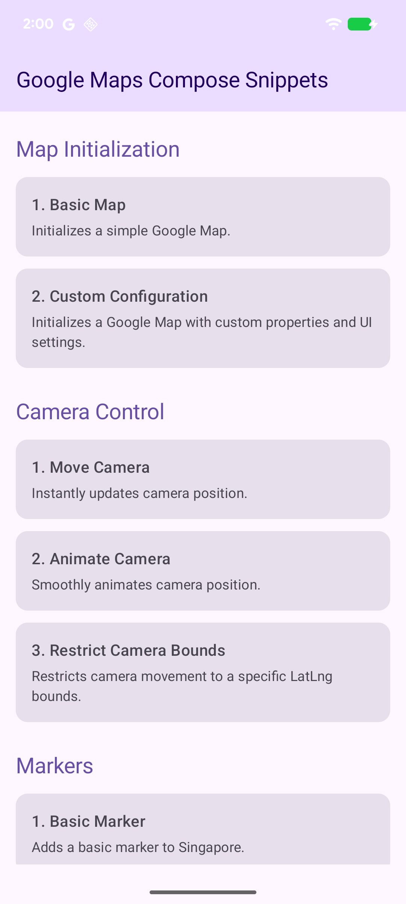
  - **Kotlin**
    - [snippets/src/main/java/com/google/maps/android/compose/snippets/MapInitSnippets.kt](../snippets/src/main/java/com/google/maps/android/compose/snippets/MapInitSnippets.kt#L39-L46)
    - Tag: `maps_android_compose_init_basic`
- **2. Custom Configuration**:
  - *Description*: Configures map properties (e.g. Satellite view) and UI settings (e.g. enabling compass).
  - **Screenshot**:
    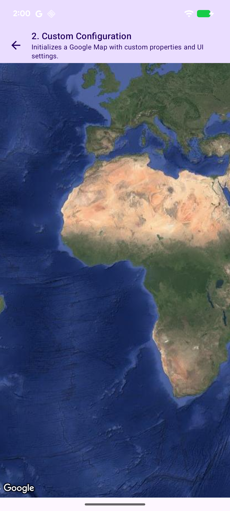
  - **Kotlin**
    - [snippets/src/main/java/com/google/maps/android/compose/snippets/MapInitSnippets.kt](../snippets/src/main/java/com/google/maps/android/compose/snippets/MapInitSnippets.kt#L57-L86)
    - Tag: `maps_android_compose_init_custom`

### Camera Control
> Snippets demonstrating dynamic camera movement, animations, and bounding box restrictions.

- **1. Move Camera**:
  - *Description*: Instantly updates the camera position to a new location.
  - **Screenshot**:
    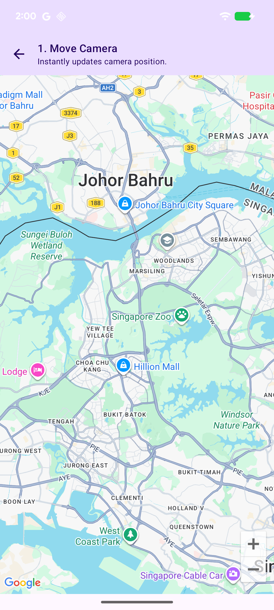
  - **Kotlin**
    - [snippets/src/main/java/com/google/maps/android/compose/snippets/CameraSnippets.kt](../snippets/src/main/java/com/google/maps/android/compose/snippets/CameraSnippets.kt#L49-L65)
    - Tag: `maps_android_compose_camera_move`
- **2. Animate Camera**:
  - *Description*: Smoothly animates the camera to a target position over a duration.
  - **Screenshot**:
    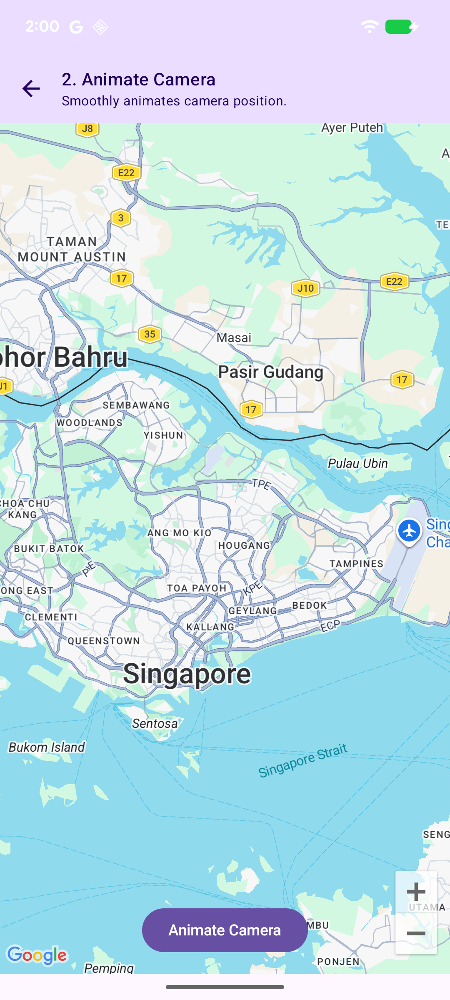
  - **Kotlin**
    - [snippets/src/main/java/com/google/maps/android/compose/snippets/CameraSnippets.kt](../snippets/src/main/java/com/google/maps/android/compose/snippets/CameraSnippets.kt#L77-L103)
    - Tag: `maps_android_compose_camera_animate`
- **3. Restrict Camera Bounds**:
  - *Description*: Constrains the camera view port to a specific LatLng bounds.
  - **Screenshot**:
    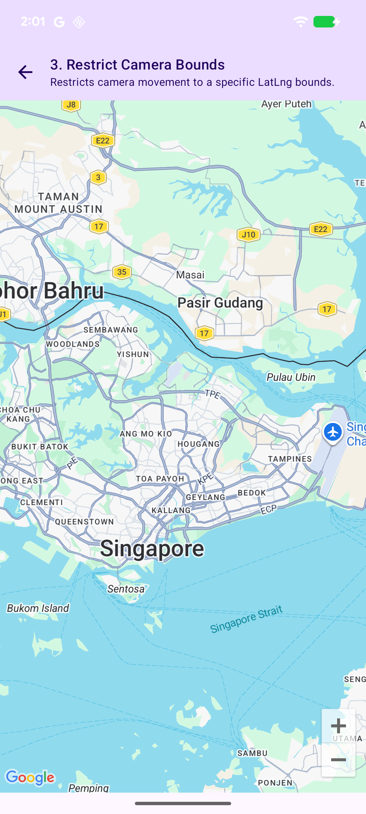
  - **Kotlin**
    - [snippets/src/main/java/com/google/maps/android/compose/snippets/CameraSnippets.kt](../snippets/src/main/java/com/google/maps/android/compose/snippets/CameraSnippets.kt#L114-L131)
    - Tag: `maps_android_compose_camera_bounds`

### Markers
> Snippets demonstrating standard markers, custom marker icons, custom Composable-rendered markers, and custom info windows.

- **1. Basic Marker**:
  - *Description*: Adds a basic marker to Singapore with a title and snippet.
  - **Screenshot**:
    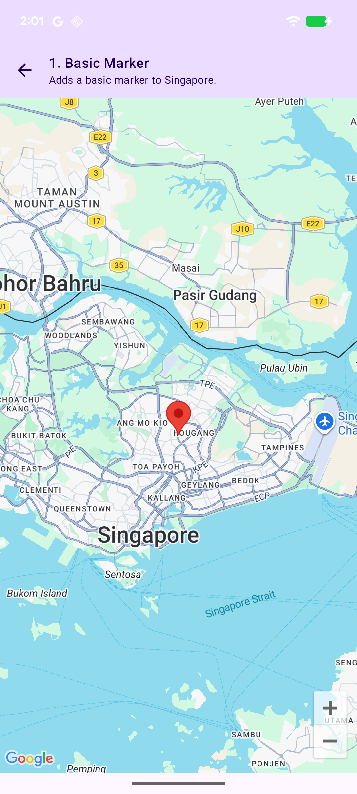
  - **Kotlin**
    - [snippets/src/main/java/com/google/maps/android/compose/snippets/MarkerSnippets.kt](../snippets/src/main/java/com/google/maps/android/compose/snippets/MarkerSnippets.kt#L50-L66)
    - Tag: `maps_android_compose_marker_basic`
- **2. Custom Marker Icon**:
  - *Description*: Adds a marker using custom drawable properties (e.g., default azure color).
  - **Screenshot**:
    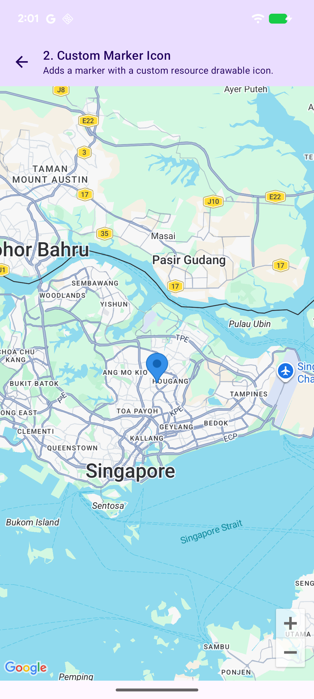
  - **Kotlin**
    - [snippets/src/main/java/com/google/maps/android/compose/snippets/MarkerSnippets.kt](../snippets/src/main/java/com/google/maps/android/compose/snippets/MarkerSnippets.kt#L77-L96)
    - Tag: `maps_android_compose_marker_custom_icon`
- **3. Marker Composable**:
  - *Description*: Renders arbitrary Compose layouts directly on the map as an interactive marker.
  - **Screenshot**:
    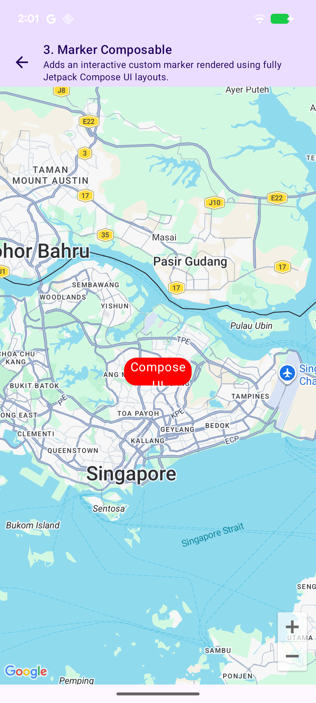
  - **Kotlin**
    - [snippets/src/main/java/com/google/maps/android/compose/snippets/MarkerSnippets.kt](../snippets/src/main/java/com/google/maps/android/compose/snippets/MarkerSnippets.kt#L107-L139)
    - Tag: `maps_android_compose_marker_composable`
- **4. Custom Info Window Composable**:
  - *Description*: Customizes the balloon info window popup using a Compose layout.
  - **Screenshot**:
    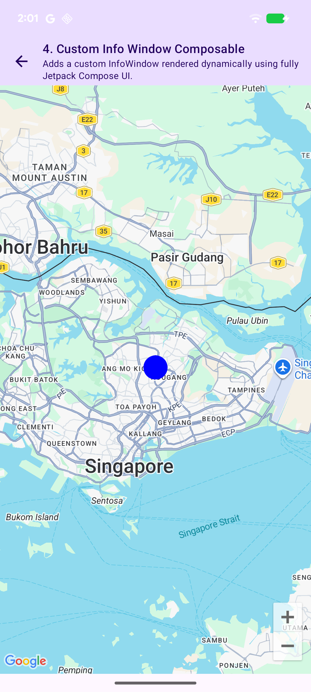
  - **Kotlin**
    - [snippets/src/main/java/com/google/maps/android/compose/snippets/MarkerSnippets.kt](../snippets/src/main/java/com/google/maps/android/compose/snippets/MarkerSnippets.kt#L150-L191)
    - Tag: `maps_android_compose_marker_info_window`

### Shapes
> Snippets demonstrating vector overlays on the map.

- **1. Polyline**:
  - *Description*: Draws a solid color Polyline connecting multiple coordinates.
  - **Screenshot**:
    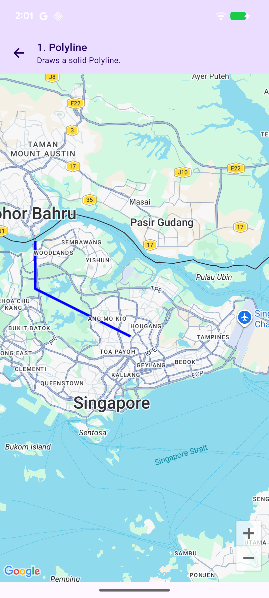
  - **Kotlin**
    - [snippets/src/main/java/com/google/maps/android/compose/snippets/ShapeSnippets.kt](../snippets/src/main/java/com/google/maps/android/compose/snippets/ShapeSnippets.kt#L39-L62)
    - Tag: `maps_android_compose_polyline`
- **2. Polygon**:
  - *Description*: Draws a closed, filled polygon shape with custom outline styling.
  - **Screenshot**:
    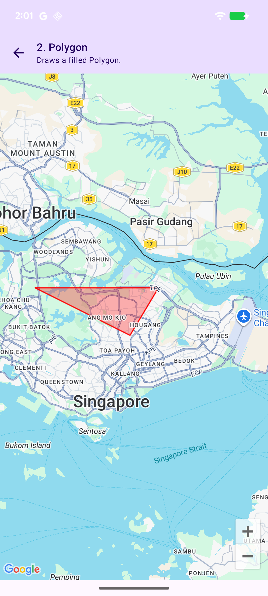
  - **Kotlin**
    - [snippets/src/main/java/com/google/maps/android/compose/snippets/ShapeSnippets.kt](../snippets/src/main/java/com/google/maps/android/compose/snippets/ShapeSnippets.kt#L72-L96)
    - Tag: `maps_android_compose_polygon`
- **3. Circle**:
  - *Description*: Draws a styled solid circle centered at a coordinate.
  - **Screenshot**:
    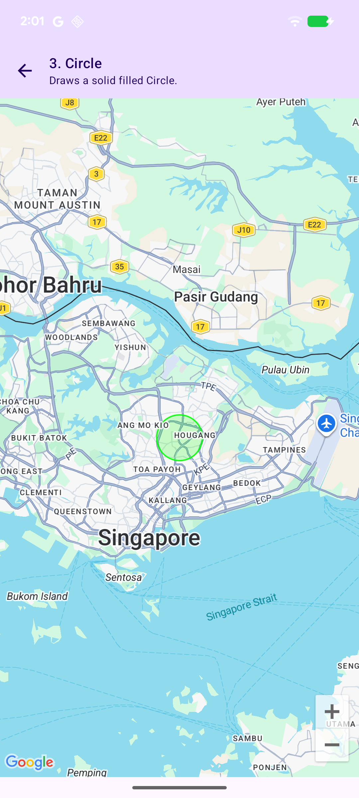
  - **Kotlin**
    - [snippets/src/main/java/com/google/maps/android/compose/snippets/ShapeSnippets.kt](../snippets/src/main/java/com/google/maps/android/compose/snippets/ShapeSnippets.kt#L107-L124)
    - Tag: `maps_android_compose_circle`

### Clustering
> Snippets demonstrating grouping of markers.

- **1. Marker Clustering**:
  - *Description*: Clusters adjacent markers dynamically using `Clustering` from Compose utility extensions.
  - **Screenshot**:
    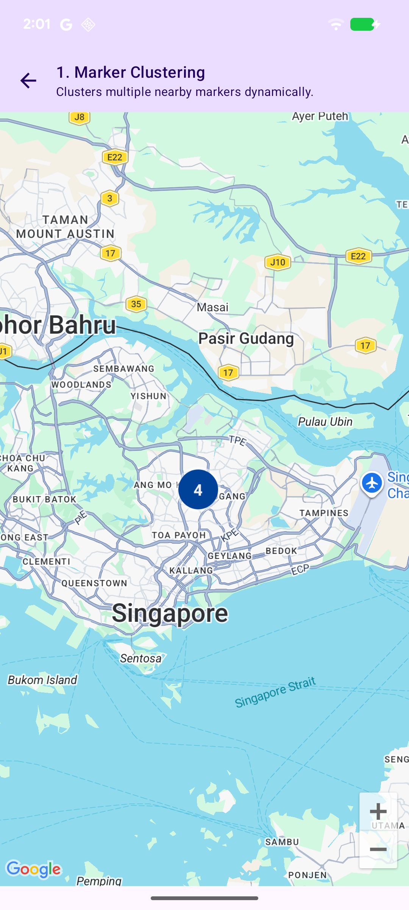
  - **Kotlin**
    - [snippets/src/main/java/com/google/maps/android/compose/snippets/ClusteringSnippets.kt](../snippets/src/main/java/com/google/maps/android/compose/snippets/ClusteringSnippets.kt#L58-L90)
    - Tag: `maps_android_compose_clustering`

### Data Layers
> Snippets demonstrating importing and rendering geographic data formats.

- **1. GeoJSON Layer**:
  - *Description*: Loads and overlays a styled GeoJSON data layer dynamically on the map.
  - **Screenshot**:
    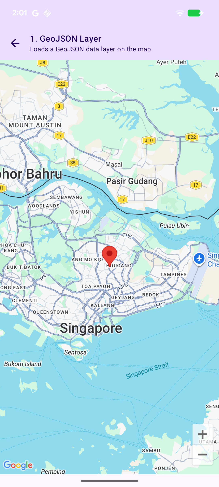
  - **Kotlin**
    - [snippets/src/main/java/com/google/maps/android/compose/snippets/DataLayerSnippets.kt](../snippets/src/main/java/com/google/maps/android/compose/snippets/DataLayerSnippets.kt#L42-L72)
    - Tag: `maps_android_compose_geojson_layer`
- **2. KML Layer**:
  - *Description*: Loads, parses, and renders geographic KML vector overlays on the map.
  - **Screenshot**:
    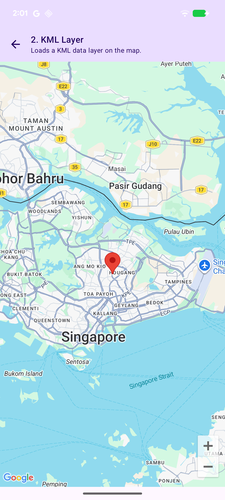
  - **Kotlin**
    - [snippets/src/main/java/com/google/maps/android/compose/snippets/DataLayerSnippets.kt](../snippets/src/main/java/com/google/maps/android/compose/snippets/DataLayerSnippets.kt#L84-L111)
    - Tag: `maps_android_compose_kml_layer`

### Overlays & Widgets
> Snippets demonstrating image overlays, custom tile layers, and on-screen widgets.

- **1. Ground Overlay**:
  - *Description*: Displays a static image clamped flatly over geographic coordinate bounds.
  - **Screenshot**:
    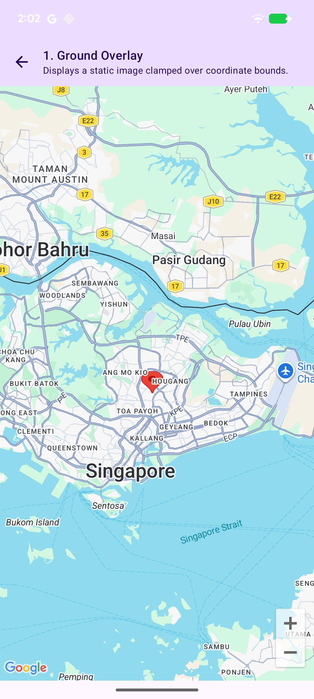
  - **Kotlin**
    - [snippets/src/main/java/com/google/maps/android/compose/snippets/AdvancedSnippets.kt](../snippets/src/main/java/com/google/maps/android/compose/snippets/AdvancedSnippets.kt#L58-L80)
    - Tag: `maps_android_compose_ground_overlay`
- **2. Tile Overlay**:
  - *Description*: Overlays custom dynamic styled map tile layers on top of the viewport.
  - **Screenshot**:
    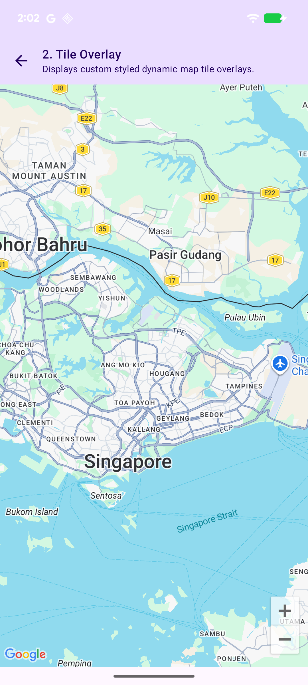
  - **Kotlin**
    - [snippets/src/main/java/com/google/maps/android/compose/snippets/AdvancedSnippets.kt](../snippets/src/main/java/com/google/maps/android/compose/snippets/AdvancedSnippets.kt#L91-L114)
    - Tag: `maps_android_compose_tile_overlay`
- **3. WMS Tile Overlay**:
  - *Description*: Overlays WMS raster tile layers from a remote map service dynamically.
  - **Screenshot**:
    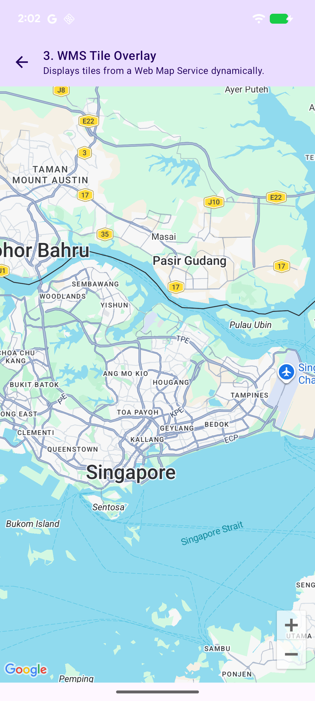
  - **Kotlin**
    - [snippets/src/main/java/com/google/maps/android/compose/snippets/AdvancedSnippets.kt](../snippets/src/main/java/com/google/maps/android/compose/snippets/AdvancedSnippets.kt#L124-L144)
    - Tag: `maps_android_compose_wms_tile_overlay`
- **4. Compose Bitmap Descriptor**:
  - *Description*: Automatically renders arbitrary Compose Composable graphics dynamically into standard marker bitmaps.
  - **Screenshot**:
    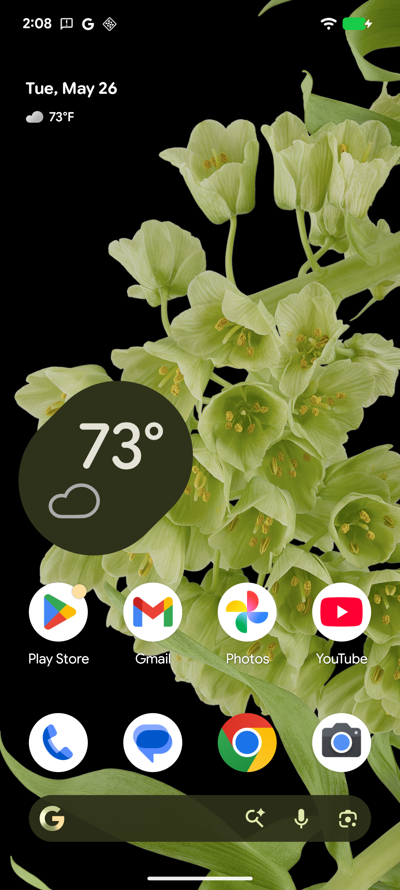
  - **Kotlin**
    - [snippets/src/main/java/com/google/maps/android/compose/snippets/AdvancedSnippets.kt](../snippets/src/main/java/com/google/maps/android/compose/snippets/AdvancedSnippets.kt#L156-L185)
    - Tag: `maps_android_compose_remember_bitmap_descriptor`
- **5. Scale Bar Widget**:
  - *Description*: Overlays a dynamic on-screen distance scale bar widget indicating zoom scale ratios.
  - **Screenshot**:
    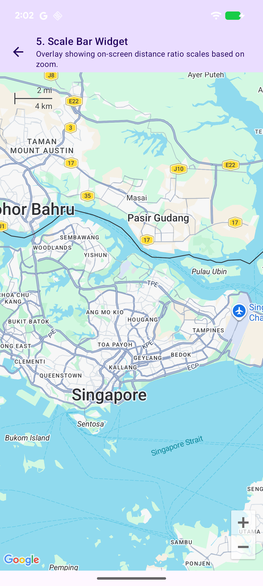
  - **Kotlin**
    - [snippets/src/main/java/com/google/maps/android/compose/snippets/AdvancedSnippets.kt](../snippets/src/main/java/com/google/maps/android/compose/snippets/AdvancedSnippets.kt#L195-L214)
    - Tag: `maps_android_compose_scale_bar`
