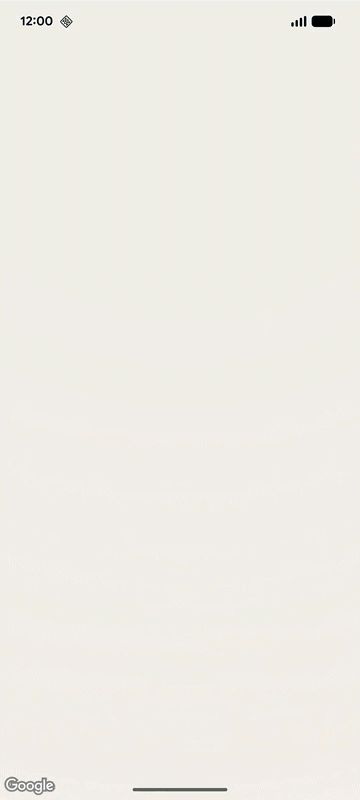
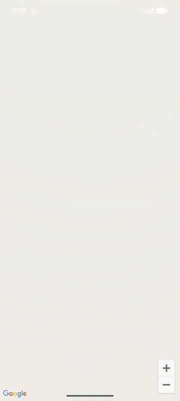

# 🚀 Jetpack Compose Samples Catalog

This directory contains the Compose samples for the Google Maps SDK for Android. We use a state-driven approach and lean on the `maps-compose` library.

## 📊 Sample Status

| Feature | Status | Source Code | Screenshot | Description |
| :--- | :---: | :--- | :--- | :--- |
| **Basic Map** | ✅ Done | [Source Code](../snippets/src/main/java/com/google/maps/android/compose/snippets/MapInitSnippets.kt#L58-L60) ([Activity](../snippets/src/main/java/com/google/maps/android/compose/snippets/SnippetActivities.kt#L58)) |  | Initializes a basic, interactive Google Map with standard road layers and default controls. **Region Tag:** `maps_android_compose_init_basic` |
| **Custom Configuration** | ✅ Done | [Source Code](../snippets/src/main/java/com/google/maps/android/compose/snippets/MapInitSnippets.kt#L71-L111) ([Activity](../snippets/src/main/java/com/google/maps/android/compose/snippets/SnippetActivities.kt#L70)) |  | Configures custom map properties such as satellite type layers, compass visibility, and hides default zoom controls. **Region Tag:** `maps_android_compose_init_custom` |
| **Move Camera** | ✅ Done | [Source Code](../snippets/src/main/java/com/google/maps/android/compose/snippets/CameraSnippets.kt#L42-L53) ([Activity](../snippets/src/main/java/com/google/maps/android/compose/snippets/SnippetActivities.kt#L82)) |  | Demonstrates how to move the map camera instantly to a targeted coordinate and zoom level without animations. **Region Tag:** `maps_android_compose_camera_move` |
| **Animate Camera** | ✅ Done | [Source Code](../snippets/src/main/java/com/google/maps/android/compose/snippets/CameraSnippets.kt#L64-L77) ([Activity](../snippets/src/main/java/com/google/maps/android/compose/snippets/SnippetActivities.kt#L94)) |  | Demonstrates how to smoothly animate the map camera to a target position over a specified duration in milliseconds. **Region Tag:** `maps_android_compose_camera_animate` |
| **Camera Restrictions** | ✅ Done | [Source Code](../snippets/src/main/java/com/google/maps/android/compose/snippets/CameraSnippets.kt#L88-L102) ([Activity](../snippets/src/main/java/com/google/maps/android/compose/snippets/SnippetActivities.kt#L106)) |  | Constrains camera panning and zooming strictly within a geographic LatLngBounds box (e.g., Singapore bounds). **Region Tag:** `maps_android_compose_camera_bounds` |
| **Basic Marker** | ✅ Done | [Source Code](../snippets/src/main/java/com/google/maps/android/compose/snippets/MarkerSnippets.kt#L49-L56) ([Activity](../snippets/src/main/java/com/google/maps/android/compose/snippets/SnippetActivities.kt#L119)) |  | Adds a standard red pin marker to the map centered over Singapore coordinates, complete with title and snippet popups. **Region Tag:** `maps_android_compose_marker_basic` |
| **Custom Marker Icon** | ✅ Done | [Source Code](../snippets/src/main/java/com/google/maps/android/compose/snippets/MarkerSnippets.kt#L67-L81) ([Activity](../snippets/src/main/java/com/google/maps/android/compose/snippets/SnippetActivities.kt#L131)) |  | Customizes the standard marker icon to a default azure color, demonstrating how to pass custom drawable/descriptor objects. **Region Tag:** `maps_android_compose_marker_custom_icon` |
| **Marker Composable** | ✅ Done | [Source Code](../snippets/src/main/java/com/google/maps/android/compose/snippets/MarkerSnippets.kt#L93-L117) ([Activity](../snippets/src/main/java/com/google/maps/android/compose/snippets/SnippetActivities.kt#L143)) |  | Renders arbitrary Jetpack Compose layout structures directly on the map as custom interactive markers (e.g., rounded red badges). **Region Tag:** `maps_android_compose_marker_composable` |
| **Custom Info Window** | ✅ Done | [Source Code](../snippets/src/main/java/com/google/maps/android/compose/snippets/MarkerSnippets.kt#L128-L158) ([Activity](../snippets/src/main/java/com/google/maps/android/compose/snippets/SnippetActivities.kt#L155)) |  | Replaces the standard marker balloon popup with an arbitrary styled Compose layout (e.g., yellow rectangular banner). **Region Tag:** `maps_android_compose_marker_info_window` |
| **Polylines** | ✅ Done | [Source Code](../snippets/src/main/java/com/google/maps/android/compose/snippets/ShapeSnippets.kt#L39-L47) ([Activity](../snippets/src/main/java/com/google/maps/android/compose/snippets/SnippetActivities.kt#L166)) |  | Draws a styled solid blue vector line connecting three coordinate vertices on the map. **Region Tag:** `maps_android_compose_polyline` |
| **Polygons** | ✅ Done | [Source Code](../snippets/src/main/java/com/google/maps/android/compose/snippets/ShapeSnippets.kt#L58-L71) ([Activity](../snippets/src/main/java/com/google/maps/android/compose/snippets/SnippetActivities.kt#L178)) |  | Draws a closed, filled red triangular area with a solid red border. **Region Tag:** `maps_android_compose_polygon` |
| **Circle Overlay** | ✅ Done | [Source Code](../snippets/src/main/java/com/google/maps/android/compose/snippets/ShapeSnippets.kt#L82-L94) ([Activity](../snippets/src/main/java/com/google/maps/android/compose/snippets/SnippetActivities.kt#L190)) |  | Draws a translucent green geographic circle centered at Singapore coordinates. **Region Tag:** `maps_android_compose_circle` |
| **Marker Clustering** | ✅ Done | [Source Code](../snippets/src/main/java/com/google/maps/android/compose/snippets/ClusteringSnippets.kt#L61-L88) ([Activity](../snippets/src/main/java/com/google/maps/android/compose/snippets/SnippetActivities.kt#L202)) |  | Groups adjacent markers dynamically inside cluster badges to avoid map clutter. **Region Tag:** `maps_android_compose_clustering` |
| **GeoJSON Layer** | ✅ Done | [Source Code](../snippets/src/main/java/com/google/maps/android/compose/snippets/DataLayerSnippets.kt#L42-L72) ([Activity](../snippets/src/main/java/com/google/maps/android/compose/snippets/SnippetActivities.kt#L214)) |  | Parses and overlays a GeoJSON data layer dynamically in Compose using `MapEffect` to obtain the underlying GoogleMap instance safely. **Region Tag:** `maps_android_compose_geojson_layer` |
| **KML Layer** | ✅ Done | [Source Code](../snippets/src/main/java/com/google/maps/android/compose/snippets/DataLayerSnippets.kt#L84-L117) ([Activity](../snippets/src/main/java/com/google/maps/android/compose/snippets/SnippetActivities.kt#L225)) |  | Parses and overlays a KML data stream dynamically in Compose using `MapEffect`. **Region Tag:** `maps_android_compose_kml_layer` |
| **Ground Overlay** | ✅ Done | [Source Code](../snippets/src/main/java/com/google/maps/android/compose/snippets/AdvancedSnippets.kt#L59-L97) ([Activity](../snippets/src/main/java/com/google/maps/android/compose/snippets/SnippetActivities.kt#L237)) |  | Displays a static flat image stretched flatly over geographic coordinate bounds. **Region Tag:** `maps_android_compose_ground_overlay` |
| **Tile Overlay** | ✅ Done | [Source Code](../snippets/src/main/java/com/google/maps/android/compose/snippets/AdvancedSnippets.kt#L108-L144) ([Activity](../snippets/src/main/java/com/google/maps/android/compose/snippets/SnippetActivities.kt#L249)) |  | Overlays custom dynamic styled map tile layers on top of the default viewport. **Region Tag:** `maps_android_compose_tile_overlay` |
| **WMS Tile Overlay** | ✅ Done | [Source Code](../snippets/src/main/java/com/google/maps/android/compose/snippets/AdvancedSnippets.kt#L155-L181) ([Activity](../snippets/src/main/java/com/google/maps/android/compose/snippets/SnippetActivities.kt#L261)) |  | Displays dynamically loaded raster map tile layers fetched from a Web Map Service (WMS) using EPSG:3857 projection. **Region Tag:** `maps_android_compose_wms_tile_overlay` |
| **Compose Bitmap Descriptor** | ✅ Done | [Source Code](../snippets/src/main/java/com/google/maps/android/compose/snippets/AdvancedSnippets.kt#L193-L228) ([Activity](../snippets/src/main/java/com/google/maps/android/compose/snippets/SnippetActivities.kt#L273)) |  | Renders custom graphics dynamically to standard marker descriptors using standard Canvas drawing. **Region Tag:** `maps_android_compose_remember_bitmap_descriptor` |
| **Scale Bar Widget** | ✅ Done | [Source Code](../snippets/src/main/java/com/google/maps/android/compose/snippets/AdvancedSnippets.kt#L240-L252) ([Activity](../snippets/src/main/java/com/google/maps/android/compose/snippets/SnippetActivities.kt#L289)) |  | Displays an on-screen dynamic map distance scale bar overlay widget that reacts to pinch-to-zoom events. **Region Tag:** `maps_android_compose_scale_bar` |
